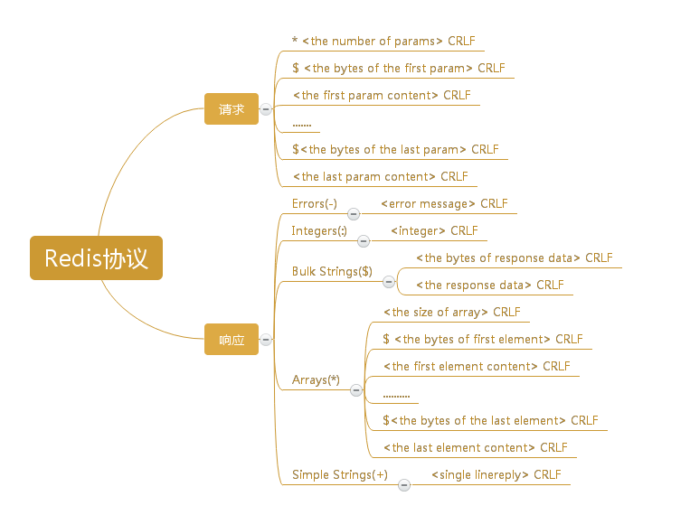

# Redis协议规范
redis基于请求响应模型，协议力求简单、快捷，详情请参考[官方规范文档](http://redis.io/topics/protocol)。

# 例子

## 请求

 命令         | 协议格式
 ----------  | --------
LLEN mylist  | "2\r\n\$4\r\nLLEN\r\n\$6\r\nmylist\r\n
 
  
  
## 响应

 响应类型        | 响应内容
 ---------------|---------
 Simple Strings | +OK\r\n
 Errors    | -ERR unknown command 'foobar'\r\n
 Errors    |-WRONGTYPE Operation against a key holding the wrong kind of value
Integers|:1000\r\n
Bulk Strings|$6\r\n\foobar\r\n
Bulk Strings|$0\r\n\r\n
Bulk Strings|$-1\r\n
Arrays | \*0\r\n
Arrays |\*2\r\n\$3\r\nfoo\r\n$3\r\nbar\r\n
Arrays|\*2\r\n\*3\r\n:1\r\n:2\r\n:3\r\n*2\r\n+Foo\r\n-Bar\r\n

 

